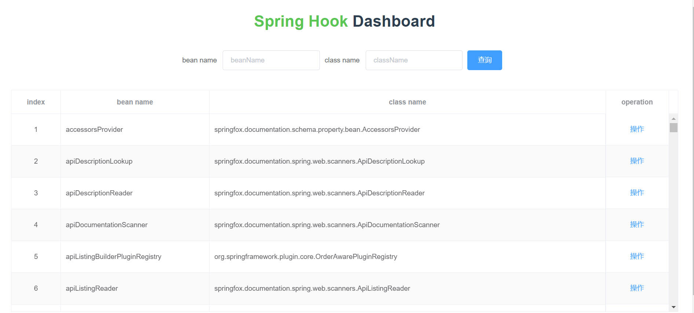
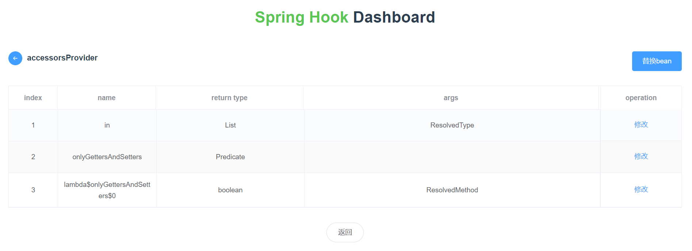
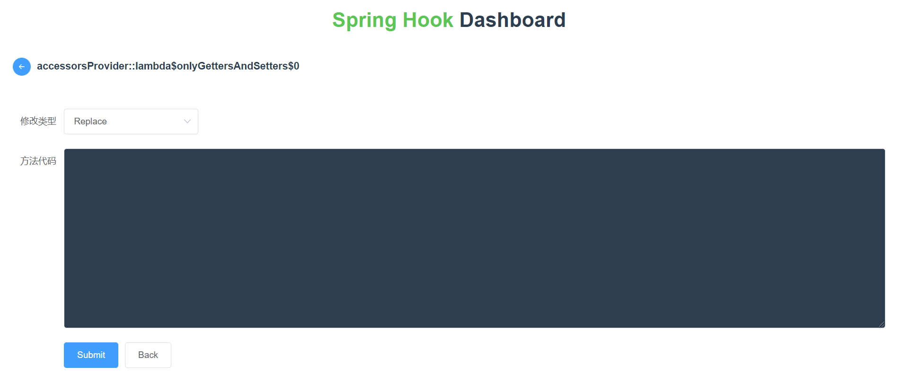

# spring-hook

该框架使用Javassist和spring框架开发而成，可以实现运行时修改代码，替换指定的方法，在指定方法前后插入代码以及替换指定的class
可以用于线上项目紧急维护，bug定位等

#使用方法
##1. mvn install，然后将依赖引入到指定的项目

```
        <dependency>
            <groupId>com.fly.spring</groupId>
            <artifactId>spring-hook</artifactId>
            <version>0.0.1-SNAPSHOT</version>
        </dependency>
```

##2. 在项目中添加注解：

@EnableSpringHook

##3. 启动项目

访问http://localhost:port/spring-hook

#图例

1.访问/spring-hook路径，进入dashboard，可以看到当前项目中所有的bean

2.选择要修改的bean，可以进入bean详情，进行替换bean或者修改指定方法

3.点击指定方法，进入方法修改页面



